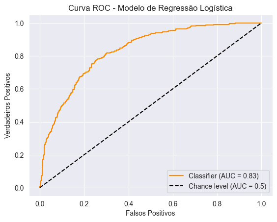
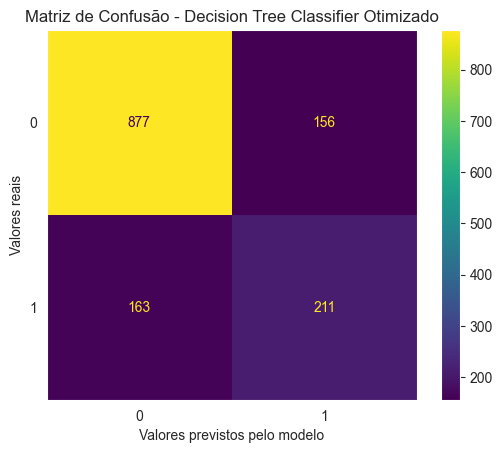
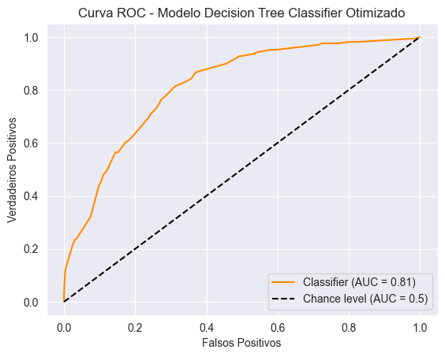
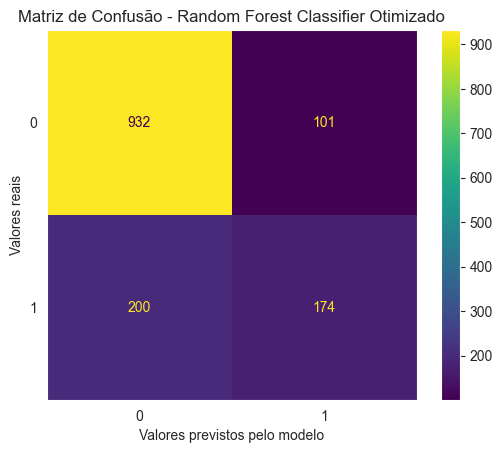

# Definindo um modelo de classificação com machine learning para analisar churn de clientes

## Objetivo do projeto

Este projeto tem como objetivo definir um modelo preditivo de classificação utilizando machine learning para avaliar os caso de churn de clientes em uma empresa.

Isto será feito de tal forma a avaliar as métricas de performance para cada modelo testado, escolhendo apenas um deles que apresentou o melhor desempenho.

## Sobre os dados

O dataset disponibilizado contempla diversas informações a respeito dos clientes desta compania. Dentre elas existem dados categóricos e dados numéricos, conforme as listas abaixo.

Variáveis numéricas:
- Tenure = Número de meses que o cliente está na base
- MonthlyCharges = A quantia consumida por cliente mensalmente
- TotalCharges = A quantia consumida por cliente total

Variáveis categóricas:
- CustomerID = Id do cliente
- Gender = gênero do cliente
- SeniorCitizen = informação a respeito da idade do cliente
- Partner = se o cliente é ou não casado
- Dependents = se o cliente tem dependentes
- PhoneService = cliente tem serviço telefonico
- MulitpleLines = se o cliente tem várias linhas ou não
- InternetService = tipo do serviço de internet
- OnlineSecurity = se o cliente tem segurança online
- OnlineBackup = se o cliente tem Backup Online
- DeviceProtection = se o cliente tem proteção do dispositivo
- TechSupport = se o cliente tem suporte técnico
- StreamingTV = se o cliente tem streaming de TV
- StreamingMovies = se o cliente tem serviço de streaming de filmes
- Contract = termo de contrato do cliente
- PaperlessBilling = se o cliente tem ou não boleto sem papel
- PaymentMethod = método de pagamento do cliente

E, além disso, existe ainda a variável "target" ou objetivo, ao qual deseja prever seus valores,

- Churn = Cliente deu churn ou não

## Bibliotecas utilizadas no desenvolvimento do projeto

Segue uma lista com as bibliotecas utilizadas no desenvolvimento e resolução deste case.
- pandas
- numpy
- matplotlib
- seaborn
- sklearn

## Deployment

Para executar o projeto é necessário baixar o arquivo "modelo_classificacao.ipynb" (código do projeto) e o database "churn.csv". Feito isso, salvar ambos os arquivos na mesma pasta e executar o código utilizando programas de visualização e leituras de códigos em jupyter notebook, como Visual Studio Code por exemplo, ou algum outro software similar.

Obs: para executar o código corretamente as bibliotecas listadas na sessão anterior precisam estar instaladas em sua máquina.

## Resultados

Para este caso, foram testados 3 modelos de classificação de machine learning diferentes: LogisticRegression, DecisionTreeClassifier e RandomForestClassifier.

No caso dos dois últimos modelos testados, obteve-se resultados que indicaram casos de Overfitting, onde as métricas da base de treino são bem próximas a 1 e bem maiores que as métricas da base de teste. Isto acontece quando o modelo de machine learning "decora" a base de treino, acertando praticamente tudo, mas quando é passada uma nova base diferente, o modelo se perde em suas previsões. Portanto, uma otimização de hiperparâmetros foi necessária para cada um destes dois modelos a fim de corrigir este problema.

Segue nas sessões seguintes os resultados dos modelos de Regressão Logística, Decision Tree e Random Forest já otimizados

### Modelo de classificação Regressão Logística

- Matriz de Confusão do modelo:

Pelo resultado acima, a quantidade de verdadeiros positivos previstos pelo modelo, ou seja, casos em que o modelo preveniu que o cliente não era churn e de fato ele não era, foi de 914. A quantidade de verdadeiros negativos previstos pelo modelo (casos em que o modelo preveniu que o cliente era churn e de fato ele era) foi de 193. Falsos positivos foram 181 casos e falsos negativos foram 119 casos. Desta forma, temos um total de erros = 181 + 119 = 300.

- Curva ROC do modelo:

### Modelos otimizados

Para otimizar os hiperparâmetros dos modelos Decision Tree Classifier e Random Forest Classifier testados anteriormente, foi utilizada a função GridSearchCV( ) da biblioteca sklearn, onde é passado um dicionário com os parâmetros que deseja-se otimizar, qual métrica será usada como base para escolher o melhor cenário, qual tipo de cross-validation será feito.

Neste projeto, utilizou-se como métrica de seleção a Acurácia, com um cross-validation padrão K-fold = 5 em ambos os modelos otimizados.

#### Decision Tree Classifier -> Otimizado

- Matriz de Confusão do modelo:

Pelo resultado acima, a quantidade de verdadeiros positivos previstos pelo modelo foi de 877, já a quantidade de verdadeiros negativos foi 211. Os casos de falsos positivos e negativos foram 163 e 156, respectivamente. Portanto, o total de erros deste modelo foi 163 + 156 = 319. Já percebe-se aqui que a performance deste modelo foi inferior ao anterior, onde ocorreram apenas 300 erros, contudo com métricas provavelmente muito semelhantes.

- Curva ROC do modelo:

#### Random Forest Classifier -> Otimizado

- Matriz de Confusão do modelo:

Avaliando-se a matriz acima, temos um total de verdadeiros positivos previstos pelo modelo de 932, e verdadeiros negativos com 174. Os casos de falsos positivos e negativos foram 200 e 101, respectivamente. Logo, o total de erros deste modelo foi 200 + 101 = 301. Logo, temos um total de erros deste modelo praticamente igual ao modelo de Regressão Logística, e uma provável melhor performance que o anterior de Decision Tree.

- Curva ROC do modelo:

## Selecionando o melhor modelo

Segue abaixo uma tabela comparativa com as métricas calculadas para cada um dos modelos.

<table id="T_e10d6">
  <thead>
    <tr>
      <th class="blank level0" >&nbsp;</th>
      <th id="T_e10d6_level0_col0" class="col_heading level0 col0" >Acurácia</th>
      <th id="T_e10d6_level0_col1" class="col_heading level0 col1" >Acurácia Balanceada</th>
      <th id="T_e10d6_level0_col2" class="col_heading level0 col2" >Precisão</th>
      <th id="T_e10d6_level0_col3" class="col_heading level0 col3" >Recall</th>
      <th id="T_e10d6_level0_col4" class="col_heading level0 col4" >F1 Score</th>
      <th id="T_e10d6_level0_col5" class="col_heading level0 col5" >ROC AUC Score</th>
    </tr>
    <tr>
      <th class="index_name level0" >Modelos</th>
      <th class="blank col0" >&nbsp;</th>
      <th class="blank col1" >&nbsp;</th>
      <th class="blank col2" >&nbsp;</th>
      <th class="blank col3" >&nbsp;</th>
      <th class="blank col4" >&nbsp;</th>
      <th class="blank col5" >&nbsp;</th>
    </tr>
  </thead>
  <tbody>
    <tr>
      <th id="T_e10d6_level0_row0" class="row_heading level0 row0" >LogisticRegression</th>
      <td id="T_e10d6_row0_col0" class="data row0 col0" >78.68%</td>
      <td id="T_e10d6_row0_col1" class="data row0 col1" >70.04%</td>
      <td id="T_e10d6_row0_col2" class="data row0 col2" >61.86%</td>
      <td id="T_e10d6_row0_col3" class="data row0 col3" >51.60%</td>
      <td id="T_e10d6_row0_col4" class="data row0 col4" >56.27%</td>
      <td id="T_e10d6_row0_col5" class="data row0 col5" >83.19%</td>
    </tr>
    <tr>
      <th id="T_e10d6_level0_row1" class="row_heading level0 row1" >DecisionTreeClassifier - Otimizado</th>
      <td id="T_e10d6_row1_col0" class="data row1 col0" >77.33%</td>
      <td id="T_e10d6_row1_col1" class="data row1 col1" >70.66%</td>
      <td id="T_e10d6_row1_col2" class="data row1 col2" >57.49%</td>
      <td id="T_e10d6_row1_col3" class="data row1 col3" >56.42%</td>
      <td id="T_e10d6_row1_col4" class="data row1 col4" >56.95%</td>
      <td id="T_e10d6_row1_col5" class="data row1 col5" >81.41%</td>
    </tr>
    <tr>
      <th id="T_e10d6_level0_row2" class="row_heading level0 row2" >RandomForestClassifier - Otimizado</th>
      <td id="T_e10d6_row2_col0" class="data row2 col0" >78.61%</td>
      <td id="T_e10d6_row2_col1" class="data row2 col1" >68.37%</td>
      <td id="T_e10d6_row2_col2" class="data row2 col2" >63.27%</td>
      <td id="T_e10d6_row2_col3" class="data row2 col3" >46.52%</td>
      <td id="T_e10d6_row2_col4" class="data row2 col4" >53.62%</td>
      <td id="T_e10d6_row2_col5" class="data row2 col5" >83.15%</td>
    </tr>
  </tbody>
</table>

Pelos resultados da tabela acima, percebe-se que os 3 modelos tiveram métricas muito parecidas de performance. A única que destoou um pouco foi o Recall, onde obteve-se dados variando de 46 até 56%. Isto indica que o modelo Random Forest, cujo apresentou o pior índice Recall, apresentou mais falsos negativos que os demais. Ou seja, julgou como churn mais clientes que na verdade não eram churn.

Outra análise a ser feita é que em todos estes modelos a score da curva ROC apresentou bons índices, com valores na casa dos 80%, bem acima do valor limite mínimo aceitável de 50% para este parâmetro.

Desta forma, utilizando como desempate e métrica chave a Acurácia (que mede o número de predições corretas feitas pelo modelo), que inclusive foi a métrica a ser otimizado com GridSearchCV dos hiperparâmetros dos modelos de árvore de descisão, o modelo que melhor performou e consequentemente é o escolhido para fazer predições futuras de churn com os novos dados é o modelo de Regressão Logística.